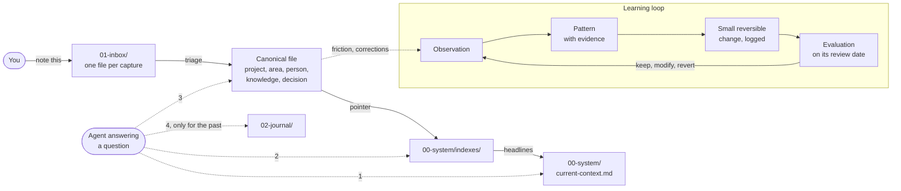

# Second Brain Blueprint

[](https://github.com/timruttedev/second-brain-blueprint/actions/workflows/checks.yml)
[](LICENSE)

A ready-to-use blueprint for an **AI-native Second Brain**: your whole life's
knowledge as plain Markdown files in a Git repository, maintained by AI
agents that capture, file, review and even improve the system itself.

This is the structure I run my own Second Brain on every day. The private
original holds my real notes; this repository holds everything else: the
folder schema, the agent instructions, the workflows, the templates, the
checks and the lessons learned. Changes to my own system flow back here.

**See a filled-in Second Brain:** [`examples/`](examples/README.md) holds a
small, complete, fictional one, including a capture before and after triage.

## Why this exists

Most note systems fail in one of two ways. Either capturing is so much work
that you stop doing it, or everything lands in one pile and you never find
it again. AI chat assistants add a third problem: their "memory" is locked
inside one vendor and quietly forgets or invents things.

This blueprint takes a different approach:

- **Markdown files in Git are the source of truth.** Not a chat history, not
  a vendor's memory. Every agent (Claude Code, Codex, Gemini, Cursor, ...)
  and every editor (Obsidian, VS Code, plain `cat`) can read them.
- **Capturing is cheap, organizing is the agent's job.** You drop a thought
  into the inbox; the agent files it in the right place later.
- **The system organizes itself and learns.** It notices friction, records
  patterns with evidence, makes small reversible improvements and checks
  later whether they worked.
- **Git is the safety net.** Every change is a commit, nothing is lost,
  every structural change can be reverted.

## How it works



Solid arrows show how knowledge is written, dotted arrows how an agent
reads: narrow to broad, stopping as soon as it has the answer.

1. **Capture:** tell the agent "note this" or drop a file into `01-inbox/`.
2. **Triage:** the agent searches for the existing home of each capture and
   files it there, instead of creating duplicates. Indexes and the current
   context get a one-line pointer, never a copy.
3. **Recall:** ask questions ("why did I choose X?", "what is open for Y?").
   The agent reads narrow to broad: current context, indexes, then the one
   canonical file, and the journal only when the question is about the past.
4. **Review:** daily notes, weekly and monthly reviews condense what
   happened and check on projects and goals.
5. **Learn:** friction and corrections become observations, repeated ones
   become patterns, and patterns lead to small, logged, reversible changes
   that are evaluated on a fixed date.

Scheduled cloud routines can run the journal, the reviews and the inbox
triage for you every day. See
[00-system/workflows/automation.md](00-system/workflows/automation.md).

## What is inside

| Path | What it is |
|---|---|
| [`AGENTS.md`](AGENTS.md) | The operating manual every AI agent reads first |
| [`CLAUDE.md`](CLAUDE.md) | Extra rules for Claude Code |
| [`.claude/rules/`](.claude/rules/) | Short, focused behavior rules |
| [`.claude/skills/`](.claude/skills/) | Claude Code skills: capture, triage, recall, review, decision, project, system |
| [`00-system/`](00-system/README.md) | The operating system: principles, taxonomy, indexes, templates, workflows, learning layer, checks |
| `01-inbox/` to `09-archive/` | Where your knowledge lives, one folder per kind |
| [`examples/`](examples/README.md) | A fictional, filled-in Second Brain to learn from (removed by setup) |

The folders in detail:

| Folder | Holds |
|---|---|
| `01-inbox/` | Unsorted captures, processed later |
| `02-journal/` | Daily, weekly, monthly and yearly notes |
| `03-projects/` | Efforts with a goal and an end |
| `04-areas/` | Ongoing responsibilities (health, finances, family, work, ...) |
| `05-people/` | People who matter in your life and work |
| `06-knowledge/` | Reusable knowledge you want to keep |
| `07-decisions/` | Decision records: what you chose and why |
| `08-resources/` | External references and documents |
| `09-archive/` | Inactive content, kept, never deleted |

## Quick start

You need git, Python 3.10 or newer and an AI coding agent
([Claude Code](https://claude.com/claude-code) recommended).

1. Click **Use this template** on GitHub (or clone and push to your own
   private repository). Keep your copy **private**: it will hold your life.
2. Open it with your AI coding agent.
3. Say: *"Set up my Second Brain."* The agent follows
   [GETTING-STARTED.md](GETTING-STARTED.md): it asks for your name,
   language and time zone, runs the setup script, and then asks about your
   current focus, projects and people.
4. Start capturing: *"Note that I want to renew my passport before May."*
5. Once a week, say *"weekly review"*. Or set up the scheduled routines and
   let it run by itself.

Step by step, including the automation: [GETTING-STARTED.md](GETTING-STARTED.md).

## Glossary

| Term | Meaning |
|---|---|
| **Canonical home** | The one file where a fact lives. Everything else links to it instead of copying it. |
| **Signpost** | A short file that points to where things are and holds no content of its own, for example `current-context.md` or the overview files of the learning logs. |
| **Index** | A signpost for one kind of thing (projects, areas, people, goals, decisions, to-dos) in `00-system/indexes/`: one line and one link per entry. |
| **Capture** | A raw thought, dropped into `01-inbox/` as its own small file, without deciding where it belongs. |
| **Triage** | Processing the inbox: each piece of a capture goes to its canonical home, the indexes get a pointer, and the capture is deleted (Git keeps it). |
| **Canary** | A deliberately broken link the link checker must find on every full run. If it does not, the checker fails instead of reporting a false green. |
| **Heartbeat** | The small state file every scheduled run commits, even when there was nothing to do. Its commit is the proof that the run did its job. |
| **Orphan** | A file that no other file links to. Nobody finds it, so the checker reports it. |
| **Due evaluation** | A structural change in the organization log whose review date has passed without a verdict (keep, modify or revert). The checker reports it. |
| **Single-session mode** | The default: one agent session at a time, commits go straight to `main`. |
| **Multi-session mode** | Opt-in for several parallel sessions: each works in its own Git worktree and branch, and a task ends with a pull request. Switched on in the operating mode section of [`AGENTS.md`](AGENTS.md). |

## Design principles

- **Preserve knowledge, evolve structure.** Facts, decisions and history are
  never lost. Folders, names, templates and workflows may change whenever
  that makes the system better.
- **Search before create.** One fact, one canonical place. Link, do not copy.
- **Current state vs. history.** The newest statement by the owner wins; the
  old value stays as dated history.
- **Facts vs. assumptions.** AI inference never silently becomes a fact.
- **A rule that no mechanism checks does not hold.** Important rules come
  with a script: [`linkcheck.py`](00-system/scripts/linkcheck.py) checks
  links, anchors, orphans, frontmatter and overdue evaluations, and it
  carries a canary so it cannot silently report green. CI runs it on every
  push and pull request.
- **Small, reversible steps.** Evolution over revolution. Every significant
  change is logged with a date to evaluate it.

The lessons behind these principles, each learned the hard way in daily
use, are collected in
[00-system/learning/patterns.md](00-system/learning/patterns.md).

## FAQ

**Do I need Claude Code?** No. The instructions live in `AGENTS.md` and
work with any agent that reads repository instructions. Claude Code gets the
most out of it because of the skills and scheduled routines.

**Does it work with Codex, Cursor or Gemini?** Yes. Codex and Cursor read
`AGENTS.md` on their own. For Gemini CLI, point its context file setting at
`AGENTS.md` or add a one-line `GEMINI.md` that refers to it. The skills in
`.claude/skills/` are specific to Claude Code; their model-agnostic
equivalents are the workflows in
[`00-system/workflows/`](00-system/workflows/README.md), and the workflow
wins if the two ever disagree.

**Do I need Obsidian?** No. Links are standard relative Markdown links.
Obsidian works nicely on top, but the system never depends on it.

**How is this different from Obsidian with PARA, or Notion AI?** PARA and
this blueprint share the idea of projects, areas, resources and archive,
and you can keep Obsidian as your editor. The difference is who does the
work: here the agent files, links, reviews and checks by written rules, and
every change is a Git commit. Notion AI offers a polished hosted interface,
databases and team collaboration, which this does not. In exchange you get
plain files you own, a full history, and the freedom to switch AI providers
without an export. If you do not want to touch Git or a terminal at all,
Notion is the easier choice.

**How do I capture from my phone?** Anything that can put a file into
`01-inbox/` works: the Claude mobile app with your repository connected
(say "note that ..."), any Git client app, or the GitHub web editor. If you
already run an automation tool, an email-to-inbox pipeline that turns mails
to a private address into capture files works well too; the
[capture workflow](00-system/workflows/capture.md) describes the file
format such pipelines write.

**What do the scheduled routines cost per month?** It depends on your
provider, your plan and how much each run does, so there is no honest fixed
number. On a subscription plan the runs usually count against your usage
limits; with API billing you pay per token. To keep it low: start without
routines and add one only after the process has worked by hand; skip the
daily journal run if you write dailies yourself; keep routine prompts short
(they point to the workflow docs instead of repeating them); let idle runs
end right after the heartbeat; and look at your provider's usage page after
the first week.

**Is my data used to train AI models?** That depends on your provider and
the settings of your account or plan, not on this blueprint. Check the
privacy and data settings of every AI tool you connect, and of your Git
host.

**What about privacy?** Your copy should be a private repository. The rules
forbid storing secrets (passwords, tokens) and support sensitivity levels
(`confidential`, `restricted`) in frontmatter. Anything you send to an AI
provider leaves your machine; decide consciously what goes in. Rules for
recording medical or legal documents in full are available as
[opt-in policies](00-system/optional-policies.md), off by default.

**Can I change the structure?** Yes, that is the point. The structure is
version 1, not a fixed schema. The agent may reorganize, as long as no
knowledge is lost and the change is logged.

## Upgrading your copy

This blueprint follows my own Second Brain. When I improve a workflow, a
rule or a check there, the generalized version lands here. Read the
[CHANGELOG](CHANGELOG.md) first: it says what changed and whether a change
needs action in your copy. Then pull in what you want:

```bash
git remote add upstream https://github.com/timruttedev/second-brain-blueprint.git
git fetch upstream

# What changed in the system parts since the version you started from
git diff <old-version> upstream/main -- 00-system/ .claude/ AGENTS.md CLAUDE.md

# Option A: apply those changes as a patch, with a three-way merge
git diff <old-version> upstream/main -- 00-system/ .claude/ AGENTS.md CLAUDE.md > upstream.patch
git apply -3 upstream.patch

# Option B: take single commits
git cherry-pick <commit>
```

`<old-version>` is the release tag or commit you started from. If you
cloned this repository with its history instead of using **Use this
template**, a plain `git merge upstream/main` works too. When resolving
conflicts, keep your own content: your indexes, current context and
learning log entries are yours, only the rest of `00-system/` and `.claude/`
is blueprint territory. Changed lines may bring back placeholders such as
`<OWNER_NAME>`; replace them and run
`python3 00-system/scripts/linkcheck.py --orphans`. Or ask your agent:
*"Compare my system files with upstream and bring over the changes from the
latest release."*

## About the author

I am **Tim Rutte**, a cloud and software architect for business-critical
systems with more than 20 years of backend experience. I build systems that
run reliably, and lately more and more of them put AI to productive use.
This blueprint is what I use to run my own life and work.

More about me and my work: [timrutte.de](https://timrutte.de)

## Contributing

Ideas, fixes and questions are welcome: see [CONTRIBUTING.md](CONTRIBUTING.md).
Security issues go through [SECURITY.md](SECURITY.md). Please never paste
content from your own Second Brain into an issue.

## License

[MIT](LICENSE). Use it, adapt it, build your own.
